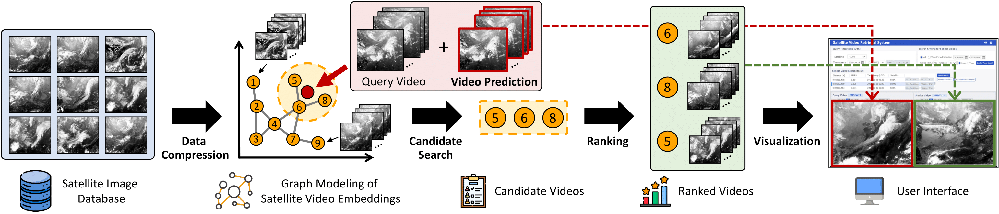

# SkySearch: Satellite Video Search at Scale

### Official Repository for the paper **SkySearch: Satellite Video Search at Scale** ([KDD 2025](https://kdd2025.kdd.org/) ADS Track).



## COMS Satellite Image Dataset 📁
This repository provides access to **52GB** of images captured by the [**COMS satellite**](https://en.wikipedia.org/wiki/Chollian).

- The dataset is available for download [Dropbox directory](https://www.dropbox.com/scl/fo/xr10egc7qzvwekexs1xkx/ABHnIeb-kYh1U2PVn2-Vbhg?rlkey=nzy2zh0kak31s79twygi7gcx6&st=2mr0rd0g&dl=0).

The dataset folder contains:

- Yearly folders of satellite images:
  - To extract all `.zip` files at once, run the following command in your terminal:
  - ```bash
    unzip '*.zip'
    ```
  - `2014/`, `2015/`, `2016/`, `2017/`, `2018/`, `2019/`
- Supporting data lists:
  - `data_list_ir02`: Contains paths  for selected IR02 image files.
  - `date_list_ir02`: Contains the corresponding dates for IR02 images.


## 📁 Dataset Structure


- 


## 🗂️ IR02 Data Subset

The files `data_list_ir02` and `date_list_ir02` point to a specific subset of the dataset focused on the IR02 channel. These can be used for quick experiments or training.


## Video Compression

## Video Prediction (Query Augmentation)


### To train the model:

```python
python train.py --<your-args>
```

### To run inference:
```bash
python inference.py \
  --gpu [GPU_ID] \
  --data_path [DATA_PATH] \
  --ckpt_path [CHECKPOINT_PATH] \
  --output_path [OUTPUT_PATH]
```

- A pre-trained model checkpoint can be found in the above [Dropbox directory](https://www.dropbox.com/scl/fo/xr10egc7qzvwekexs1xkx/ABHnIeb-kYh1U2PVn2-Vbhg?rlkey=nzy2zh0kak31s79twygi7gcx6&st=2mr0rd0g&dl=0):
  - `ckpt_mse30_gen10_disc60_feat1_orth1_step80000.pth`

- The generated images (video frames) will be saved to the specified OUTPUT_PATH in the format:
```
{index}_{order}.png
- index: the test sample index
- order: the frame number (0 to 11)
```

- **Acknowledgement:** This implementation is based on the official [SimVP](https://github.com/A4Bio/SimVP) repository.
